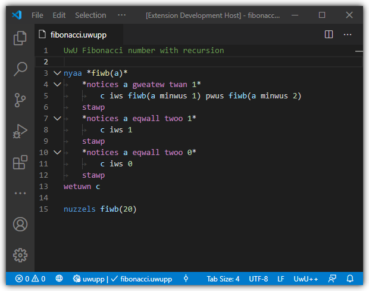

# UwU++ Syntax Highlighting

Support for the esoteric language UwU++ in Visual Studio Code.

## Syntax Highlighting

Adds syntax highlighting support for UwU++ (`.uwu` and `.uwupp`).

## Bugs

If you find any bugs (or anything else you think might be a problem) visit the
[issue section](https://github.com/89netraM/uwupp-language-extension/issues)
of [the repository](https://github.com/89netraM/uwupp-language-extension).